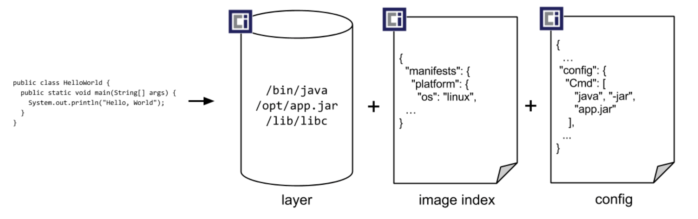
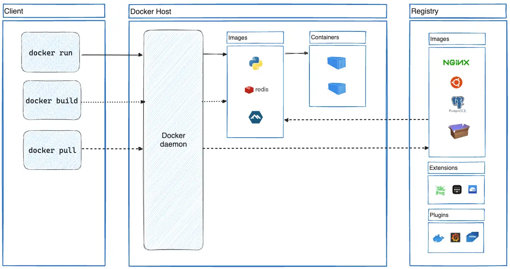

# Testcontainers

Presentasjon Javabin Bergen 19/9-2024
Sondre Eikanger Kvalø 
Sonat Consulting Bergen
@zapodot https://github.com/zapodot

---
<!-- 
header: 'Testcontainers'
footer: 'Javabin Bergen 19/9-2024'
-->

# Plan for dagen
 1. Hva er testcontainers?
 1. Hvordan gjorde vi testing før?
 1. Testcontainers 101 med eksempler
 1. Fordeler og ulemper
 1. Konklusjon

---
### Hva er en container?

Kilde: *Open Container Initiative Image spec v 1.1.0*

---

Kilde: *[Docker overview](https://docs.docker.com/get-started/docker-overview/)*

---

---

### Hva menes med test?
---

### Hvordan gjorde vi dette før?
- Testet mot faktisk test/produksjonsmiljø
- Kjørte mocks/stubs som lot deg dekke en del av behovet (f.eks H2Database i kompabilitetsmodus)
---
## Funksjonalitet
### Kjøre testkode mot enkelt container
#### Eksempel Java/JUnit
#### Eksempel Kotlin/Kotest
#### Eksempel C#
### Koble sammen containere
#### Eksempel Java/JUnit
#### Eksempel Kotlin/Kotest
### Kjøre containere i sky
#### Trenger ikke ha Docker eller Podman installert
#### Pay-as-you-go modell
#### Kanskje mest nyttig i CI-sammenheng?

## Fordeler ved å skrive tester som bruker testcontainers
### Får testet integrasjonskode mot noe som ligner veldig på det du bruker i produksjon
### Får testet kode som er strenger i kodebasen, f.eks SQL som kompilatoren ikke har et forhold til
## Ulemper med å ha tester som bruker testcontainers
### Tar lengre tid å kjøre testene
### Lett for at man ungår å refaktorere koden som integrerer mot tredjepart

## Konklusjon
### Tester som er avhengig av en tredjepart er ikke enhetstester men integrasjonstester
### Kan velge å skille ut testene som krever containere
